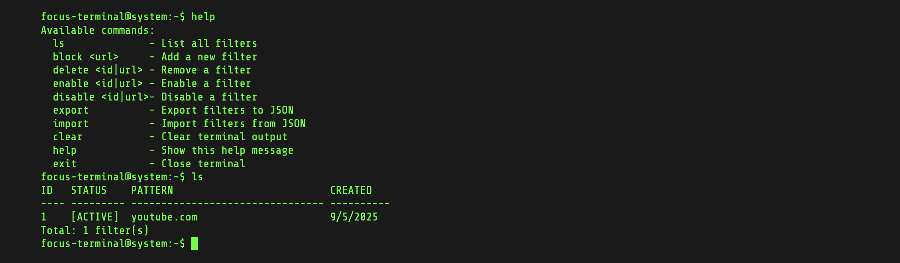

# Focus terminal - Productivity Extension

Privacy-focused Chrome extension built with TypeScript for managing website access and improving focus—absolutely no tracking or data collection.



## Features

- 🚫 Unlimited website filtering
- 📦 Import/Export filter lists
- ⚡ Real-time filter toggling
- 💾 Local storage persistence
- 🔒 Privacy-focused (no external data)
- ⚡ **Ultra-fast development** with Vite HMR
- 🚀 **Modern build pipeline** (5x faster than Webpack)

## Development

### Prerequisites

- Node.js (v18+)
- npm or yarn

### Setup

```bash
# Install dependencies
npm install

# Start development server with hot reload
npm run dev

# Build for production
npm run build

# Preview production build
npm run preview
```

### Development Experience

- **Instant startup** - Development server starts in <1s
- **Hot Module Replacement** - Changes reflect instantly
- **TypeScript support** - Zero configuration required
- **Modern tooling** - Latest build optimizations

### Installation

1. Build the extension: `npm run build`
2. Open Chrome and navigate to `chrome://extensions/`
3. Enable "Developer mode"
4. Click "Load unpacked"
5. Select the `dist` folder

## Architecture

```
src/
├── core/          # Background service worker
│   └── service.ts # Main filtering logic
├── interface/     # Options page
│   ├── dashboard.html
│   ├── dashboard.ts
│   └── dashboard.css
└── pages/         # Interceptor page
    ├── interceptor.html
    ├── interceptor.ts
    └── interceptor.css
```

## Technologies

- **TypeScript** - Type-safe development
- **Vite** - Modern build tool with instant HMR
- **@crxjs/vite-plugin** - Chrome extension development
- **Chrome Extension Manifest V3** - Latest extension API
- **Declarative Net Request API** - Website filtering

## License

MIT